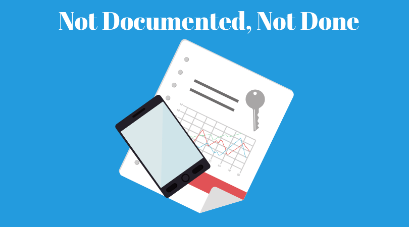
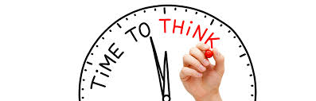
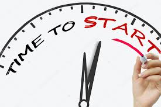

# Github and Documentation
A practical guide for learning how to **use Github to document your open source project**, that is for learning how to **gitument**. Once documented on Github, **your project will be able to come onto the developers market** and take advantage of its incentivizing mechanisms to carry on developing and scaling up. Active documentation on Github therefore constitutes the basis for the development of your project on the developers market.

This guide mainly provides you with a short introdution to the main elements that are necessary to start gitumenting/using Github as a documentation tool (that is documentation, Github, Markdown,the Readme, the Posts and Wiki page), as well as with hyperlinks redirecting you to all useful webpages managed by Github that can help you achieve this task. 

Our objective is threefold
- to convince you of documenting your project on Github
- to help you save as much time as possible in your "Gitumentation" learning process
- to facilitate your entry onto the developers market

We also plan to provide you with a very short but concrete example of documentation of Readmes, Posts and Wikis (Wiki pages).

### Table of contents 

- [About](#about)

- [Introduction to documentation: THEORY](#introduction-to-documentation-theory)
    - [Why should I document my project?](#why-i-should-document-my-project)
    - [How difficult is it to document my project on Github?](#difficulty-of-documenting-on-github)
    - [Gitumentation: Readmes, Posts and Wikis](#gitumentation-readmes-posts-and-wikis)
    - [Gitumentation and the developers market](#gitumentation-and-the-developers-market)
    
- [Introduction to documentation with Github: PRACTICE](#introduction-to-documentation-with-github-practice)
    - [Start using Github](#start-using-github)
    - [Start documenting your project on Github with your Readme, Posts and Wiki pages](#start-documenting-your-project-on-github-with-your-readme-posts-and-wiki-pages)
    - [Start using Markdown](#start-using-markdown)
    
- [Introduction to documentation: EXAMPLES](#introduction-to-documentation-examples)
   
### About
Started in the SDG solution space in Geneva, we aim to provide potential makers with a guide as well as an example of how to use Github to document their projects and activities. New makers might indeed not be familiar with the notion of documentation, the tools available to that purpose and the way of using those tools efficiently. Well, this is exactly the reason this project has been designed for.

For those who have only few experience in documentation and who might feel anxious at the idea of using and struggling with Github: **no worries**. As a non-technical person, I already found myself in this situation, which consequently slowed down the progression of the project I needed to document at that time. 

By following this guide, you should be able to reduce substantially your *documentation learning time*, that is the hours you should spend to become aware of the importance of documentation (1), to look for an effective way to document your project (2) and to learn how to use a tool that allows you to do so (3).

This guide is divided in three parts: **Theory**, **practice** and **examples** regarding documentation on Github.

  

## Introduction to documentation THEORY

### Why I should document my project

1. The first answer to this question is that the documentation of your project on Github is necessary in order to access the developers market that will help you scale up your project. 
2. Moreover, Github will also provide you with a concrete webpage as a result of your documentation (on the basis of your Readme and posts). 
3. But a good documentation also comes with other advantages. Let me quote an inspiring webpage from [projectconnections.com](https://www.projectconnections.com/knowhow/burning-questions/what-is-project-documentation.html) if you want to know more about them:

> When your business focuses on efficiency, cost minimization, and speed-to-market, creating lots of documentation can seem counterproductive. If the documentation doesn't directly support a deliverable, why do it? Project documentation covers documents created during and for the project itself. The documentation process has a deeper purpose than merely creating piles of paper.
>   - Documentation **stimulates and structures critical thinking** in planning the project's goals, risks, and constraints. The document is the evidence and chronicle of this critical thinking.
>   - It **provides memory containers** for managing a level of detail that cannot be kept in people's heads. This includes the small details easily overlooked during day-to-day project work, as well as the larger things easily remembered today, but potentially lost or forgotten due to the passage of time or critical personnel changes.
>   - It **keeps the team and other stakeholders synced up and informed about project changes, issues, and progress**.
    
> In many projects, the documentation is often done late, done poorly, or not done at all—usually because the documentation is perceived as having little or no value. And, in fact, this is true if the documents are created as an afterthought or a necessary evil. Even documents with adequate content will lose value if they are created at the wrong time during the project, or aren't used in the project management process. Here are some examples:
    
>   - **Timing**: If the project documentation is created at the wrong project stage, it may have little or no value, even if its content is quite good. **Examples**: a vision document created late in the project; a detailed schedule created before the stakeholders have agreed on an overall project vision.
    
>   - **Use**: If the plan, vision, or risk analysis documents are created and then rarely or never referenced, they will likely have little or no value except for generating some initial critical thinking during their creation. **Examples**: a risk analysis that isn't referenced to measure progress on mitigations, or updated with newly discovered risks as they occur; a requirements document that isn't referenced later as a design completeness checklist.
    
>   - **Content**: Inadequate or incomplete content decreases a document's value, even if it is created on time and used correctly. Examples: a status report for product development that doesn't track the product costs; a risk analysis that doesn't include risk mitigations.

### Difficulty of documenting on Github

Technical difficulties and obstacles may well make up one of the reasons preventing makers from documenting their project on Github. This is especially the case for those who, like me, have almost no technical or coding background. Some attention, efforts and time are therefore needed by some people to get used to Github and its "writing-language" called *[Markdown](https://en.wikipedia.org/wiki/Markdown)*. 

But this is no sufficient reason to make you abandon documentation. Github, thanks to some of its features (in particular to its version control system), is in fact a really good tool for documentation since it automatically records all the changes people have done as well as the steps they have taken during their projects. Soon after starting your github documentation, you'll realize how useful and beneficial it can be for you and your team.

### Gitumentation: Readmes, Posts and Wikis

Github is a software development platform that provides you with some concrete tools for documenting your project, namely 
1. the **Readme**: a first and overall presentation of your project
2. the **Posts**: a presentation of your project's progress
3. the **Wiki page** or **wiki**: a private page for documenting private and more detailed parts of your project that won't be shown publicly

Those are the main tools that will be presented in this guide for helping you document on Github. The first tool you'll be using is the *Readme* in order to provide a first and general introduction of your project. The Readme is what will first appear on the webpage of your project that Github will be hosting automatically for you. The second tool are *the Posts* that you'll be publishing in order to present the general progress of your project in more details. The posts will also show up on your project's webpage hosted on Github right after your Readme. *Wiki pages* are finally more of a private use and won't appear directly on your webpage. They can be used to write down the day to day progress of your project as well as some private information about your project that you'd like to keep safe.

### Gitumentation and the developers market

General information about the developers market is given to you in one of its Posts [introducing developer's market and roadmap](http://blog.developers.market/propositions/2019/03/30/general-project-presentation.html) and its [whitepaper](http://blog.developers.market/whitepaper).

As already said, the [developers market](http://blog.developers.market) and in particular the projects that have access to it are all linked to Github. Indeed, to add your project on the developers market, your project first needs to be hosted on a Github repository. Github can therefore be seen as an essential condition for your project to access the developers market. 

Moreover, the tokens that projects can acquire on the developers market are also linked to Github. The potential tokens that  projects acquire on the market indeed come from commits (or changes) that you and your team make on your project's Github repository. The main elements you need to remember here is that all **changes/commmits on your Readme and Posts made by your team can be awarded tokens** on the developers market whereas **changes/commits in your Wiki page cannot be awarded any token on the market**.

## Introduction to documentation with Github PRACTICE

Why is Github even interesting for someone who'd like to document its project? 
Github, through its version control system, is indeed a more than relevant tool for keeping track of one's project and letting people (within *and* outside of your team) know about *what is and has been going on*: it automatically records all the changes that have been done and stores the steps that have been taken throughout any project that it hosts.

Github provides you with a [guide](https://guides.github.com) presenting you the main aspects of Github through many chapters. No need to read them all. You'll mainly be dealing with three of them: [**Hello world**](https://guides.github.com/activities/hello-world/), [**Documenting your project on Github**](https://guides.github.com/features/wikis/) and [**Mastering Markdown**](https://guides.github.com/features/mastering-markdown/)

  

### Start using Github
  
#### 1) Sign up on Github:

>  [**Github.com**](https://github.com)

#### 2) Create your first repository:

> [**Hello world**](https://guides.github.com/activities/hello-world/), in its **step 1.**, will guide you on how to create your first [repository](https://help.github.com/en/articles/about-repositories):
>    1. Log in to your Github account and go to the main page of your account
>    2. Click on `Repositories` (next to "overview") and then, in the upper right corner, on the `green button "New"`
>    3. Name your repository `hello-world` and select `public`and `initialize it with a readme`
>    
>       *This is just a try, so let's name it "hello world". No need to write a short description. Make sure each time you create a new repository to select "public repository" and "initialize it with a readme"*
>    4. Great, you've created your first repository!

#### 3) Create your Readme:

> If you followed step 3., Your README.md file was automaticly created and is now available for editing in your new repository.
    
### Start [Documenting your project on Github](https://guides.github.com/features/wikis/) with your Readme, Posts and Wiki pages
  
The guide [Documenting your project on Github](https://guides.github.com/features/wikis/) provided by Github is one of the most interesting for us; it clearly mentions the role of Github as a documentation tool as well as the tools Github provides you to achieve a good documentation, namely (1)the README (a first and overall presentation of your project), (2) the Posts and (3) the Wiki page or wiki (the page where you'll be able to document your project and all your activities in detail)
 
> Good documentation is key to the success of any project. Making documentation accessible enables people to learn about a project; making it easy to update ensures that documentation stays relevant.
> Two common ways to document a project are README files and wikis:
>   - README files are a quick and simple way for other users to learn more about your work.It’s a good idea to at least have a README on your project, because it’s the first thing many people will read when they first find your work.
>   - Wikis on GitHub help you present in-depth information about your project in a useful way.

To edit your Readme and write down all this information, you'll have to start using Markdown and learning how it works (see next chapter). To accelerate this learning and editing process, I already designed a **template** for you:

#### 4) Create a second repository using the template:

> All you'll need to do to **[use this template](https://help.github.com/en/articles/creating-a-repository-from-a-template)** is 
>    1. Opening the repository of the template in just a [click](https://github.com/JonDavMartin/SummerSchool-projects-Template)
>    2. Clicking on the green `Use this template` button (near the top right corner)
>    3. Naming your new repository with the name of your project and adding a small description of it
>       
>       *Make sure your to select `public repository` and `initialize it with a readme`*
>    4. Finally clicking on `Create repository from template`
>
>       *You should now possess a second repository on Github that is based on my template. You are now able to freely start documenting your project on Github on the basis of my template. You now just have to modify the code that is already existing according to your own project and documentation*

#### 5) Start getting use to Markdown before starting your Readme, Posts and Wiki pages

Documentation on Githbub (like Readmes, Posts and Wiki pages) is based on Markdown, also defined as

> a text-to-HTML conversion tool for web writers. Markdown allows you to write using an easy-to-read, easy-to-write plain text format, then converts it to structurally valid XHTML (or HTML). Readmes, Posts and Wiki pages on Github all require Markdown.
>       *quoted from [here](https://daringfireball.net/projects/markdown/)*

Therefore, “Markdown” can be considered as (1) a plain text formatting syntax and (2) a software tool that converts the plain text formatting to HTML. 
You can now have a look at [mastering markdown](https://guides.github.com/features/mastering-markdown/) and [basic writing and formatting syntax](https://help.github.com/en/articles/basic-writing-and-formatting-syntax) that display all the usefull syntax you'll need to write down your Readme, Posts and Wiki pages properly. In case the basic syntax provided in these guides is not enough for you, you can also check [the following webpage](https://daringfireball.net/projects/markdown/syntax#blockquote) coming with more Markdown syntax. (*Don't forget some useful syntax is already provided by the template; you now just need to modify it*)

#### 6) Start formatting and editing a README:

Now, it is time to start gitumenting/documenting on Github by writing down the main information concerning your project in your Readme, that is:
- **the name of your project**: Your project’s name is the first thing people will see upon scrolling down to your README, and is included upon creation of your README file.
- **a description**: A description of your project follows. A good description is clear, short, and to the point. Describe the importance of your project, and what it does.
- **A table of Contents**: Optionally, include a table of contents in order to allow other people to quickly navigate in your Readme.
Please note that your Readme can serve as a first webpage for your project that Github will be hosting for free.

> In order to do that, just...
>   1. Go to the main page of your repository
>   2. Click on `Readme` and on the `edit button in the form of a pen` on the right of your screen (next to the "rubish button")
>   3. Start writing done your informations and text! 
>
>       *the template already gives you a basis to facilitate your start. Still, it is now time for you to start learning some simple Markdown language in order to carry on editing your Readme properly:*

#### 7) Start using POSTS

The second part of your documentation on Github/gitumentation will be made through Posts. After the main information concerning your project has been written down in your Readme, you can now start using **Posts** to document further progresses that your team is making (such as the way you choosed your project's logo or name, or the way you are building your prototype). Some  examples of Posts can be found on the [developers market website](http://blog.developers.market): [Introducing developer's market and roadmap](http://blog.developers.market/propositions/2019/03/30/general-project-presentation.html).

> To create a Post, what you need to do is...
>   1. Go to the main page of your repository
>   2. Click on the `create new file` button (next to `upload files`)
>   3. First type in `_posts/` and then `try1` when naming your file
>   4. You can now start writing your first line on the main `edit new file` box
>   5. Once you've finished writing, scroll down and click on the `commit new file` green button
>
>       *Please note you can always add an `optional extended description` when making a commit. This is very important to let the community and your team know about what was the goal behind your commit.*
>   Great, your have now created your first Post! 

Once Posts are done, you should also be able to display them on your webpage 

#### 8) Start using your WIKI PAGES/WIKIS

[About Wikis](https://help.github.com/en/articles/about-wikis) first explains you the use of a Wiki page in contrast to that of a Readme Page or a Post. As to the role of a wiki page, it says ...
> "Every GitHub repository comes equipped with a section for hosting documentation, called a wiki. You can use your repository's wiki to share long-form content about your project, such as how to use it, how you designed it, or its core principles. A README file quickly tells what your project can do, while you can use a wiki to provide additional documentation."
[Adding or editing Wiki pages](https://help.github.com/en/articles/adding-or-editing-wiki-pages) or [Editing Wki content](https://help.github.com/en/articles/editing-wiki-content) then show you how to create and modify your Wiki page.  

> To create a Wiki, what you need to do is...
>   1. Go to the main page of your repository
>   2. Click on the `wiki` button (located on the top of your screen between the `Projects` and `security` buttons)
>   3. Then click on the `create the first page` green button that appeared in the middle of your screen
>   4. Name your new wiki page, start writing your first line and finally click on `save page`
>   Great, your have now created your first Wiki page! 
>
>       *Don't forget that the changes that are made in your wiki page won't be awarded any tokens on the developers market. Wiki pages won't be displayed on your website either. I would then recommend you to store in your wiki all the information that your team is not willing to display on its website such as the people you've contacted so far or the main actions regarding your project that you and your team have been taking every day.*

## Introduction to documentation: EXAMPLES

for the documentation of our small example-project, please have a look at our [wiki page](https://github.com/JonDavMartin/GITHUB-and-DOCUMENTATION-a-practical-guide/wiki)!
 
<!-- in case I want to indent sth: "&nbsp;&nbsp;&nbsp;&nbsp;&nbsp;&nbsp;" --> 
